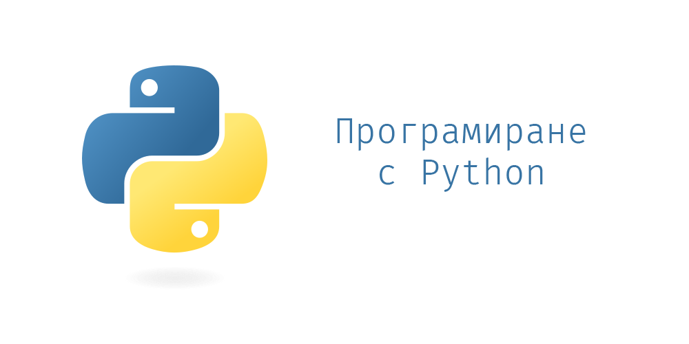

# Курс "Програмиране с Python" 2026/2027

Github repository към курса "Програмиране с Python" във ФМИ, СУ

## Контакти

Влезте в нашия **Discord сървър**: [линк СКОРО](https://armenskipop.com)

Ако имате конкретен въпрос, но не се ориентирате из информацията тук (или пък просто ви мързи да я изчетете), може да питате нашия дискорд бот *Pytoni* 🤌

Имаме за всеки случай и **общ email**: pythoncoursefmi@gmail.com, предпочитаме да не се пише до *отделен* преподавател.

## Входен тест

Тази година вече има **входен тест**, с цел отсяване предимно по мотивация.

Ще се състои на 05.10.2026г. (понеделник).

## Провеждане

Правете справка в [календара на курса](https://docs.google.com/spreadsheets/d/1qwCVPm9Ds6JYSzCfAGYmV-ClSvWOV08YxnqOQH3fvbE/edit?gid=0#gid=0) (държим го up-to-date)

* Понеделник 19-21, зала TBA
* Четвъртък 19-21, зала TBA

### Лекции

Всички лекции са събрани под формата на Jupyter notebook интерактивни записки.

JupyterBook "книжка" с всички теми има тук: https://fmipython.github.io/PythonCourse2026

| Тема номер | Тема                                                                                                                | Дата                   |
| ---------- | ------------------------------------------------------------------------------------------------------------------- | ---------------------- |
| 0          | [Въведение към курса](./00%20-%20Course%20intro/)                                                                   | 05.10.2026 (1-ви час)  |
| 1          | [Въведение в Python: какво е Python, настройка на средата, как да пуснем лекциите](./01%20-%20Intro%20to%20Python/) | 08.10.2026 |
| 2          | [Основи: променливи, типове, разклонения, цикли, функции](./02%20-%20Variables,%20types,%20control%20flow/)         | 08.10.2026, 12.10.2026, 15.10.2026 |
| 3          | [Обектно-ориентирано програмиране в Python](./03%20-%20OOP/)                                                        | 22.10.2026, 26.10.2026 |
| 4          | [Функционално програмиране в Python](./04%20-%20Functional%20Programming/)                                          | 29.10.2026, 02.11.2026 |
| 5          | [Представяне на структури от данни и алгоритми над тях](./05%20-%20Data%20Structures%20and%20Oddities/)             | 05.11.2026             |
| 6          | [Тype hints (типови анотации)](./06%20-%20Typing%20Hints/)                                                          | 12.11.2026             |
| 7          | [Грешки и изключения](./07%20-%20Exceptions%20Handling/)                                                            | 16.11.2026             |
| 8          | [Работа с файлове](./08%20-%20Files/)                                                                               | 19.11.2026             |
| 9          | [Многонишково и асинхронно програмиране](./09%20-%20Multithreading/)                                                | 26.11.2026             |
| 10         | [Работа с HTTP заявки](./10%20-%20requests/)                                                                        | 30.11.2026 (1-ви час)  |
| 11         | [Работа с Git](./11%20-%20Git/)                                                                                     | 30.11.2026 (2-ри час)  |
| 12         | [Модули и пакети](./12%20-%20Modules/)                                                                              | 03.12.2026             |
| 13         | [Принципи на качествения код, конвенциии за стил](./13%20-%20Clean%20code/)                                         | 07.12.2026             |
| 14         | [Тестване](./14%20-%20Testing/)                                                                                     | 10.12.2026             |
| 15         | [Уеб програмиране. Flask](./15%20-%20Web%20programming/)                                                            | 17.12.2026             |
| 16         | [Използване на C код в Python](./16%20-%20Using%20C%20code%20in%20Python/)                                          | 04.01.2027             |
| 17         | [Data Science & AI библиотеки (numpy, pandas, matplotlib)](./17%20-%20numpy,%20pandas,%20matplotlib/)               | 07.01.2027             |

### Workshops (упражнения)

Вместо лекция, на някои дати ще се провеждат специални упражнения, на които ще се демонстрират и решават задачи на място:

| Дата       | Теми    |
|------------|---------|
| 19.10.2026 | 1, 2    |
| 09.11.2026 | ≤ 5     |
| 23.11.2026 | ≤ 8     |
| 14.12.2026 | ≤ 14    |
| 11.01.2027 | всички  |

Следете [календара](https://docs.google.com/spreadsheets/d/1qwCVPm9Ds6JYSzCfAGYmV-ClSvWOV08YxnqOQH3fvbE/edit?gid=0#gid=0) за евентуални промени.

## Оценяване

Крайната оценка (мин 2, макс 6) се изчислява по следната формула:

$$\frac{\text{домашни} + \text{проект} + \text{защити} + \text{бонус}}{10}$$

Нужно е да отбележим, че **нито един** от трите компонента **НЕ Е** задължителен за успешното взимане на курса, при положение, че сборът им е достигнал поне 30т. (минимум за *Среден (3)*)

Максимални 65т., разделени на:
- Домашни: 10т.
- Проект: 20т.
- Защити: 30т.
- Бонус: 5т.

Бонус точките се дават (в комбинация със **сникърси**) при задаване на въпроси и активно участие в лекциите и workshop-ите.

### Проекти

Проектите в курса са **индивидуални**.

Избирате готова тема от [тук](./project-topics) или измисляте своя нова, след което пишете в `#projects` канала в Дискорд, понеже темите са със задължително одобрение. Следете дискусията там за повече информация.

Защитата се случва обикновено последния уикенд от сесията, като предаването е до 1 седмица преди това. Очаквайте обявление преди сесията за точните дати, както и за таблица за записване на слот за защита.

По време на защитата се очаква кратка 10-минутна демонстрация, след което задаваме въпроси по проекта, както и по теми от курса, с цел проверка доколко разбирате написаното/материала.

За критерии за оценяването им, [вж. тук](./projects.md)

За примерни проекти, [вж. тук](./example_projects.md)
### Домашни

Оценките от текущ контрол са от задания за домашна работа, които ще бъдат пускани поетапно след минаване на определени теми.

Домашните носят общо **максимум 10т.**

Очаквайте повече инфо относно условия, автоматична проверка и предаване.

# Misc FAQ

## Как да пиша и подкарам Python кода си?

Вж. [тук](./01%20-%20Intro%20to%20Python/install-n-setup.md)

## Как да си "пуснем" лекциите/материалите?

Вж. [тук](./01%20-%20Intro%20to%20Python/notebooks.md)

# Принос

Ако откриете бъг, правописна грешка или въобще нещо грешно, може да отворите pull request чрез съответен branch съдържащ номера на лекцията. При промяна на някоя от тетрадките, задължително финално я изпълнете отначало преди къмитването и качването в Git (за да са подредени номерцата на output-ите).
